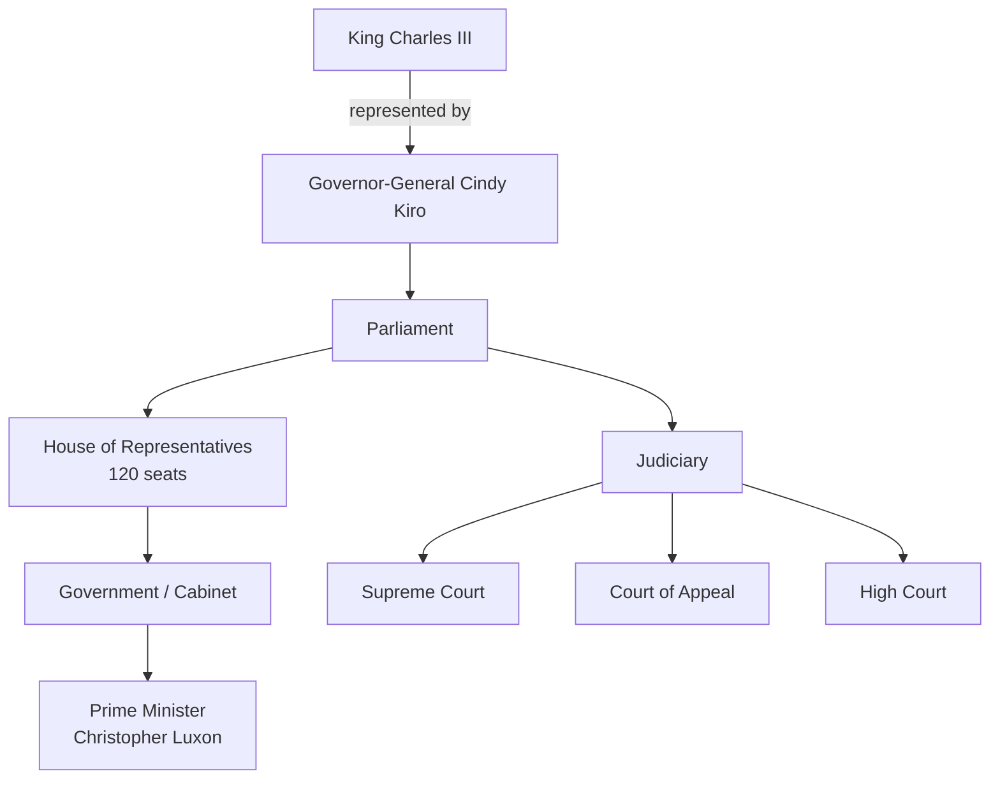

# Government of New Zealand

[[New Zealand]] is a constitutional monarchy with a parliamentary democracy, although its constitution is not codified. King Charles III is the head of state, represented by the governor-general, Cindy Kiro.

## Structure

The prime minister is Christopher Luxon (42nd PM, since 27 November 2023). Cabinet is the highest policy-making body, led by the PM, and all members are collectively responsible for decisions.

## Electoral System: MMP

Since the 1996 election, New Zealand has used **mixed-member proportional** (MMP) representation. Each voter has two votes:

1. **Electorate vote** — for a candidate in their local electorate
2. **Party vote** — for a political party

> [!note] Seat Allocation
> Based on 2018 census data, there are 72 electorates (including 7 Māori electorates). The remaining 48 of the 120 seats are allocated proportionally. A party needs at least one electorate win or $5\%$ of the total party vote to qualify for seats.

Elections since the 1930s have been dominated by two parties: **National** and **Labour**. The introduction of MMP has increased the representation of smaller parties.

### Before and After MMP

| Feature | First-Past-the-Post (pre-1996) | MMP (post-1996) |
|---------|-------------------------------|-----------------|
| Seats | Variable | 120 fixed |
| Votes per person | 1 | 2 |
| Small party representation | Minimal | Significant |
| Māori electorates | Yes | Yes (7 reserved) |
| Proportionality | Low | High |

## Governance Rankings

As of 2023, New Zealand's international standings include: ^governance-rankings

- **2nd** in strength of democratic institutions
- **3rd** in government transparency and lack of corruption
- **82%** voter turnout in recent general elections (OECD average: 69%)

> [!danger] Structural Inequality
> Despite high governance rankings, the New Zealand Human Rights Commission has identified ongoing structural discrimination. Māori comprise $16.5\%$ of the population but represent $45\%$ of convicted offenders and $53\%$ of the prison population.

## Local Government

New Zealand is organised into $11$ regional councils and $67$ territorial authorities. The 249 municipalities that existed in 1975 have been consolidated into the current two-tier structure:

- **Regional councils** (11) — regulate the natural environment, especially resource management
- **Territorial authorities** (67)
    - City councils (13)
    - District councils (53)
    - Chatham Islands Council (1)
- **Unitary authorities** (5) — act as both regional council and territorial authority

## The Realm of New Zealand

The Realm extends beyond New Zealand itself:

- **Tokelau** — dependent territory, administered by a council of three elders
- **Cook Islands** — self-governing state in free association
- **Niue** — self-governing state in free association
- **Ross Dependency** — territorial claim in Antarctica (home to Scott Base)

[^mmp]: Before MMP, almost all elections from 1853 to 1993 used the first-past-the-post system.

---
*See also: [[New Zealand]], [[History of New Zealand]]*
