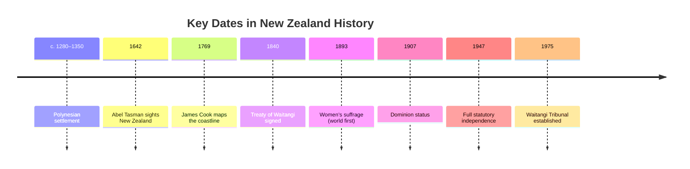

# History of New Zealand

The islands of [[New Zealand]] were the last large habitable land to be settled by humans. This note traces the key events from Polynesian arrival to modern independence.

## Polynesian Settlement (c. 1280–1350)

Polynesians arrived in oceangoing waka (canoes) in several waves between about 1280 and 1350. According to most [[Māori Culture|Māori]] oral traditions, the islands were first discovered by the semi-legendary explorer Kupe while in pursuit of a giant octopus.[^kupe]

## European Contact

In 1642, Dutch explorer Abel Tasman became the first European to sight New Zealand. He named the islands *Staten Land*, later renamed *Nova Zeelandia* by Dutch cartographers after the province of Zeeland. ^tasman-naming

> [!important] A Hostile First Encounter
> In 1642, a confrontation between Ngāti Tūmatakōkiri and Tasman's crew resulted in four crew members killed and at least one Māori hit by canister shot. Europeans did not return for 127 years.

In 1769, British explorer Captain James Cook mapped almost the entire coastline.

## The Treaty of Waitangi (1840)

The Treaty of Waitangi was first signed in the Bay of Islands on **6 February 1840**. It was negotiated between Captain William Hobson and Māori chiefs, prompted by:

1. Growing unrest between settlers and Māori
2. The New Zealand Company's land-buying activities
3. The legal ambiguity of the 1835 Declaration of Independence

> [!quote] Historical Significance
> The Treaty paved the way for Britain's declaration of sovereignty and the establishment of the Crown Colony of New Zealand in 1841.

## The New Zealand Wars

Armed conflict between the colonial government and Māori began in 1843 with the Wairau Affray. The resulting conflicts, mainly in the North Island, became known as the New Zealand Wars.

- [x] Wairau Affray (1843)
- [x] Northern War (1845–1846)
- [x] Taranaki Wars (1860–1861)
- [x] Waikato War (1863–1864)
- [ ] Full land return and reconciliation (ongoing)

## Path to Independence

| Year | Event |
|------|-------|
| 1852 | Representative government established |
| 1854 | First Parliament meets |
| 1856 | Self-governing on domestic matters |
| 1865 | Capital moves to Wellington |
| 1893 | Women's suffrage — world first |
| 1907 | Dominion status under Edward VII |
| 1947 | Statute of Westminster adopted |
| 1986 | Constitution Act removes British powers |
| 2003 | Final rights of appeal to British courts abolished |

The Musket Wars (1801–1840) encompassed over 600 battles, killing an estimated $30{,}000$–$40{,}000$ Māori. The Māori population declined to around $40\%$ of its pre-contact level during the 19th century, with introduced diseases the major factor.

## Dataview-Style Fields

type:: historical-overview
period:: 1280–present
key-event:: Treaty of Waitangi 1840
sources:: Wikipedia "New Zealand" article

[^kupe]: These traditions hold that Kupe was followed by a great fleet of settlers from Hawaiki in eastern Polynesia around 1350, though the "single great fleet" theory has been superseded by evidence of planned settlement over several decades.

---
*See also: [[New Zealand]], [[Government of New Zealand]], [[Māori Culture]]*
